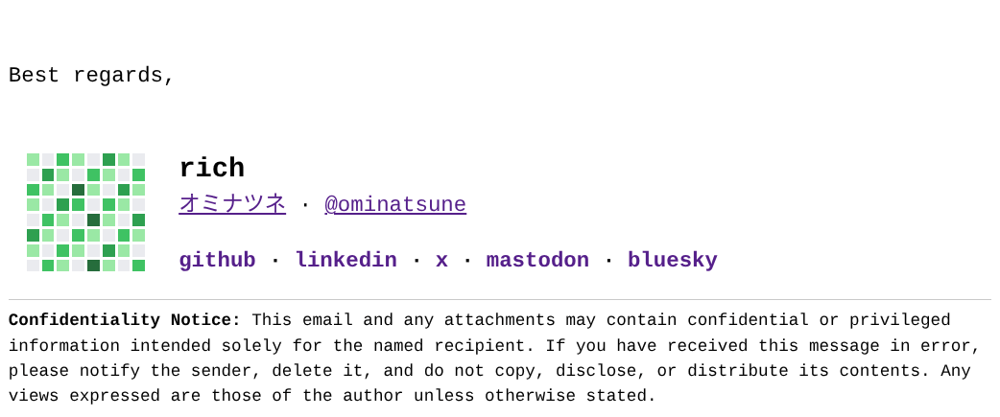

# email-signature

> A minimal, customizable HTML email signature for developers and professionals.

A clean, developer-focused HTML email signature that works across major email clients while remaining easy to customize. It features GitHub-inspired styling, responsive design, social media links, and a lightweight, dependency-free codebase.

Perfect for developers, freelancers, and professionals who want a polished, self-hosted email signature.

## Preview

## Features

- ✨ Clean, minimalist design
- 📧 Compatible with major email clients
- 🎨 Easy to customize
- 🌗 Looks great in light and dark themes
- 🔗 Built-in social media links
- ⚡ Lightweight and dependency-free
- 💻 GitHub-inspired aesthetic

## Customization

Edit the HTML file to update:

- Name
- Job title
- Social media links
- Branding
- Colors
- Disclaimer
- Contact information

## License

This project is licensed under the MIT License. See the [LICENSE](LICENSE) file for details.